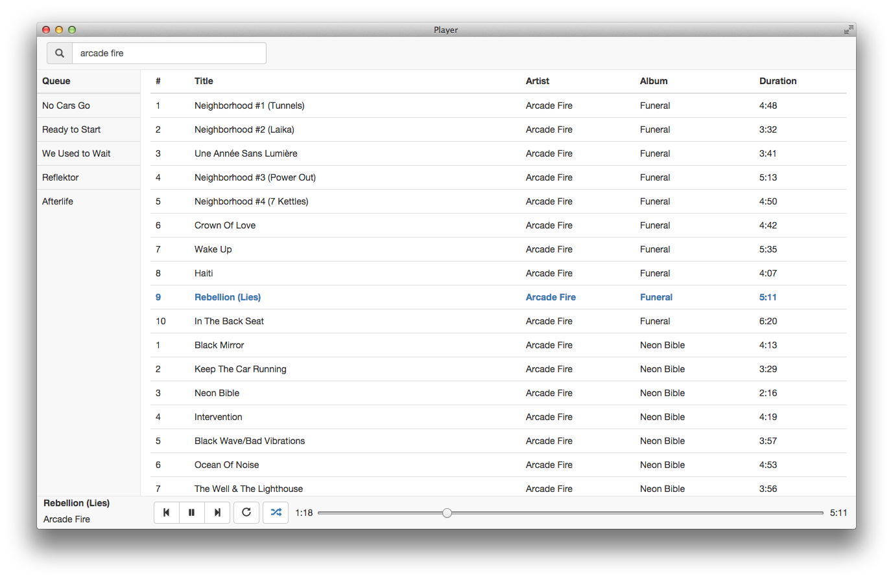

# Player

Music player built with web technologies, leveraging [nw.js](nwjs.io) and [React](https://facebook.github.io/react/) and following the [Flux](https://facebook.github.io/flux/docs/overview.html) application architecture.

Implemented features:

* Library with filtering
* Play queue
* Shuffle
* Repeat
* Seek

## Usage

#### Note: currently only tested on OSX

`npm install chrisgreen1993/player`

Rebuild on changes:

`gulp dev`

Start app:

`gulp run`

Run tests:

`npm test`
